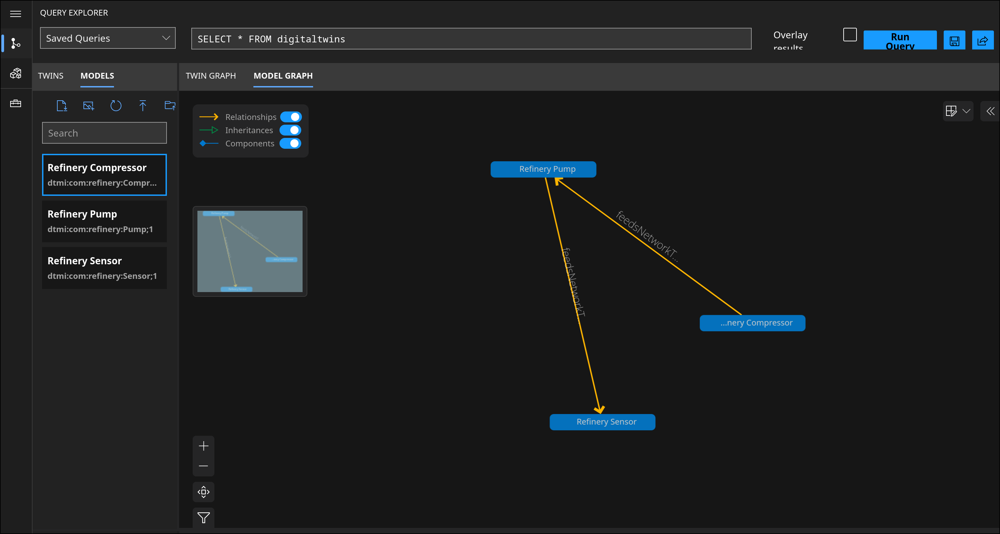

# Refinery Blast Radius

Cascading-failure simulator built on Azure Digital Twins. A `Compressor-01` twin feeds two `Pump` twins, each feeding two `Sensor` twins. When the compressor goes offline, an Azure Function walks the graph and marks every downstream twin `unreachable`. A React dashboard visualizes the graph live.

**Live demo:** https://RDG0818.github.io/refinery-cloud/



## Architecture

```
Local simulator (Python) --> IoT Hub --> Function: CascadeProcessor --> Azure Digital Twins
                                                                              ^
                                                                              |
React dashboard <-- Function: GraphStatus <---------------------------------+
```

- **Azure Digital Twins** — stores the twin graph (models, twins, relationships)
- **IoT Hub** — ingests telemetry from the simulated compressor
- **Azure Functions**
  - `CascadeProcessor` — event-triggered; on `offline`, BFS-walks the graph and marks all downstream twins `unreachable`
  - `GraphStatus` — HTTP-triggered; returns the current graph as JSON
- **React + react-flow** — polls `GraphStatus` every 3s, renders nodes colored by status

## Repo structure

```
models/               DTDL model definitions (Compressor, Pump, Sensor)
cascade-function/      Azure Functions app (CascadeProcessor, GraphStatus)
  cascade_logic.py      Core graph logic (query, patch, BFS)
  reset_graph.py         Standalone script to reset the graph to healthy
refinery-dashboard/     React dashboard
SETUP_GUIDE.md          Full step-by-step setup, exact commands, deployment
```

## Stack

Azure Digital Twins · IoT Hub · Azure Functions (Python) · React · react-flow · GitHub Pages

## Setup

See [`SETUP_GUIDE.md`](SETUP_GUIDE.md) for the full walkthrough, including exact `az` CLI commands.

## Cost

Runs within free tiers except Azure Digital Twins, which is consumption-based (no free tier). Occasional/manual use is pennies/month. See cost notes in `SETUP_GUIDE.md`.

## Status

Working end-to-end: telemetry → cascade → dashboard, all deployed. Not yet built: recovery cascade (online path), infrastructure-as-code.
